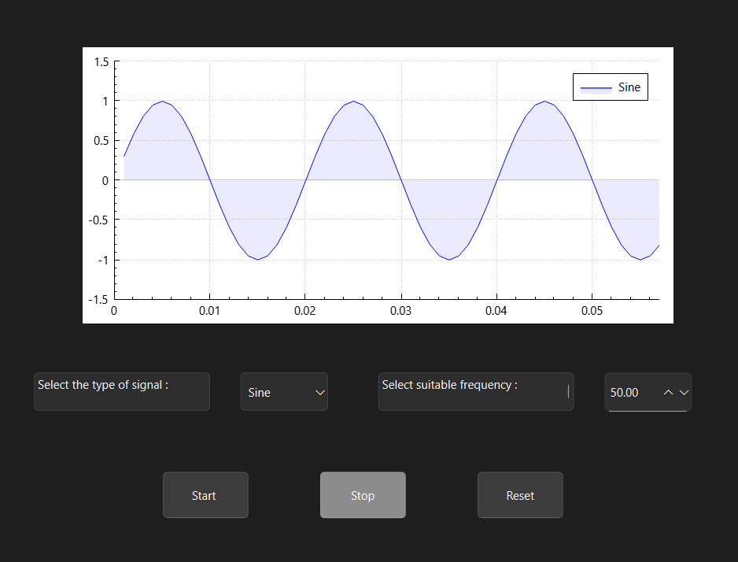
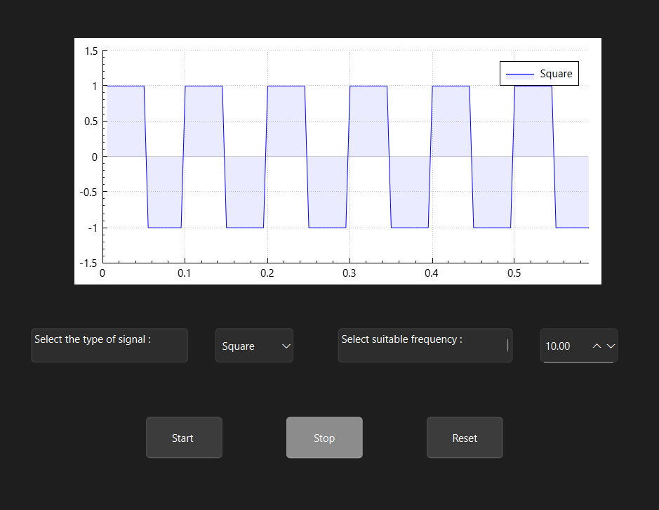
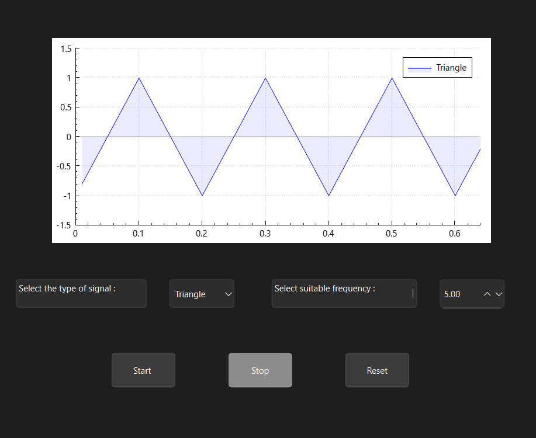
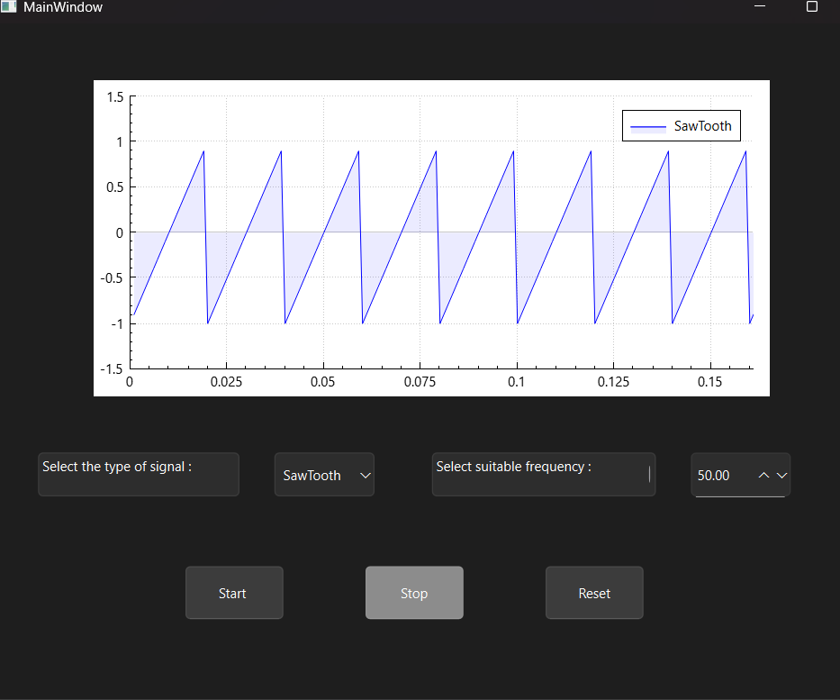

# Signal Plotter Application

A Qt-based desktop application to dynamically plot various signal waveforms (Sine, Square, Triangle, Sawtooth) in real-time. The plot can be started, stopped, and reset with smooth resume functionality.

---

## Features

- Select signal type from dropdown: Sine, Square, Triangle, Sawtooth
- Adjustable frequency input
- Start plotting signal dynamically on the graph
- Pause and resume plotting without losing previous data
- Reset the graph to clear all data and start fresh
- Real-time graph updates using QTimer
- Clear user feedback on invalid operations

---

## Getting Started

### Prerequisites

- Qt 5 or later installed
- C++ compiler (e.g., GCC, MSVC)
- Qt Creator IDE recommended for easier setup

### Build Instructions

1. Clone or download the repository
2. Open the project in Qt Creator (`.pro` or CMake files)
3. Build the project
4. Run the application

---

## Usage

1. Select the desired waveform type from the dropdown menu.
2. Set the frequency using the input spinner.
3. Click **Start** to begin plotting the signal.
4. Use **Stop** to pause the plot; click **Start** again to resume from the same position.
5. Click **Reset** to clear the graph and start over.

---
## Libraries Used
- QCustomPlot — for plotting graphs
- cmath — for math functions like sin()
- QMessageBox — for user feedback dialogs
- QPen and QBrush — for graph styling
- QTimer — for updating plot at regular intervals
-Other Qt Widgets and Core modules for UI and event handling
---

## Sample Output

### Sine Wave Plot




---

### Square Wave Plot



---

### Triangle Wave Plot


---

### Sawtooth Wave Plot



---

## Code Snippet

Example of the waveform calculation logic in `update_plot()`:

```cpp
if (signalType == "Sine") {
    value = sin(2 * M_PI * freq * t);
}
else if (signalType == "Square") {
    value = (phase < 0.5) ? 1.0 : -1.0;
}
else if (signalType == "Triangle") {
    if (phase < 0.5)
            value = 4 * phase - 1;
        else
            value = 3 - 4 * phase;
}
else if (signalType == "SawTooth") {
    value = 2 * phase - 1;
}
```
## Contributing
Feel free to open issues or submit pull requests. Please follow standard coding conventions and document any new features.
